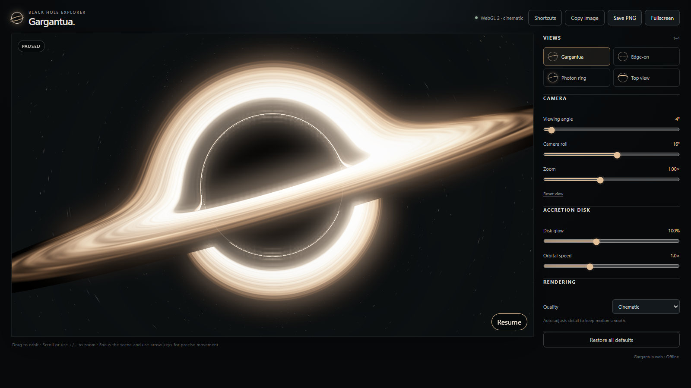

# Gargantua

Gargantua is an offline desktop visualization of a rotating black hole and its luminous accretion disk. It combines a WebGL 2 renderer, cinematic bloom, interactive camera controls, adaptive quality, and a native Electron shell in one installable application.

The renderer is designed for exploration and visual communication. It approximates gravitational lensing for a cinematic result; it is not a numerical general-relativity solver or a scientific measurement tool.



## Project status

The desktop app, reusable rendering module, automated tests, one-click Windows installer configuration, portable packages, and release automation are present. Generated installers are kept out of Git and published as release assets.

## Highlights

- Real-time black-hole shadow, photon ring, lensed accretion disk, star field, and multi-pass bloom
- Four starting views: Gargantua, Edge-on, Photon ring, and Top view
- Camera angle, camera roll, zoom, disk glow, and orbital-speed controls
- Auto, Performance, Balanced, and Cinematic quality modes
- Mouse, touch, keyboard, and accessible range controls
- PNG export, clipboard copy, fullscreen, and persistent preferences
- Automatic Canvas 2D fallback when WebGL 2 is unavailable or its context is lost
- Offline desktop runtime with a narrow, validated preload bridge and blocked network requests
- Reusable ES module for embedding independent simulator instances in another web interface

## Install and open

### Windows: recommended installer

1. Download **Gargantua-Setup.exe** from the [latest GitHub Release](https://github.com/FanZhu1998/Black_Hole/releases/latest).
2. Double-click the installer. No command prompt or administrator access is required.
3. Open Gargantua later from its Desktop shortcut or by searching for **Gargantua** in the Start menu.

The installer opens Gargantua after installation and adds it to **Installed apps**, where it can be removed normally. Installing a newer version preserves local preferences.

Unsigned development builds may display a Windows unknown-publisher warning. Public releases should be Authenticode-signed before distribution.

### Windows: portable copy

Download the portable ZIP from the [latest release](https://github.com/FanZhu1998/Black_Hole/releases/latest), choose **Extract All**, and double-click `Gargantua.exe` in the extracted folder. Keep the extracted files together.

### macOS and Linux builds

The source tree has macOS ZIP and Linux DEB, RPM, and ZIP makers configured. The automated public release is currently Windows-only; macOS and Linux packages should be built on their target operating system until signed platform release jobs are added.

## Build and run from source

### Developer setup

Requirements:

- Node.js 22.12 or newer
- pnpm 10 or newer
- A graphics driver with WebGL 2 support for the full renderer

```bash
git clone https://github.com/FanZhu1998/Black_Hole.git
cd Black_Hole
pnpm install --frozen-lockfile
pnpm dev
```

`pnpm install` downloads the Electron runtime and native build helpers. `pnpm dev` builds the renderer, opens the desktop app, and keeps Electron Forge attached for development.

### Run the browser preview

```bash
pnpm build
pnpm preview
```

Open `http://127.0.0.1:4173`. The preview server accepts local GET and HEAD requests only and exposes the generated renderer and library files, not the repository.

## Controls

| Action | Pointer or interface | Keyboard |
| --- | --- | --- |
| Orbit | Drag over the scene | Focus the scene, then use arrow keys |
| Fine or fast orbit | Camera sliders | Arrow keys; hold Shift for larger steps |
| Zoom | Scroll over the scene or use the Zoom slider | `+` or `-` while the scene is focused |
| Pause or resume | Pause button | `Space` |
| Reset camera | Reset view | `R` |
| Choose a view | View buttons | `1` through `4` |
| Save a screenshot | Save PNG | `S` |
| Enter or exit fullscreen | Fullscreen | `F` |
| Show shortcuts | Shortcuts | `?` |

The app respects the operating system's reduced-motion preference by starting in a paused state. Preferences and window placement are restored on the next launch.

### Quality modes

| Mode | Behavior |
| --- | --- |
| Auto | Starts at Balanced, reduces detail after sustained slow frames, and raises it after sustained smooth frames |
| Performance | Uses a smaller render target and lower frame cadence for modest GPUs |
| Balanced | Default compromise between sharpness and responsiveness |
| Cinematic | Uses the largest render target for screenshots and capable GPUs |

If WebGL 2 cannot start, Gargantua switches to a simplified Canvas 2D illustration. The camera, appearance, motion, and export controls remain available.

## Build desktop packages

Run packaging on the operating system you plan to distribute:

```bash
pnpm make
```

Electron Forge first rebuilds the app and icons, packages it into an ASAR archive, applies Electron security fuses, and invokes the makers supported by the current host. Successful artifacts are written under `out/make/`.

On Windows, the first installer build also downloads a checksum-verified NuGet executable into the ignored `.cache/` directory. This replaces the legacy copy bundled by Squirrel, which cannot package current Electron runtime files.

| Host | Configured outputs |
| --- | --- |
| Windows | Squirrel installer and ZIP |
| macOS | ZIP |
| Linux | DEB, RPM, and ZIP |

Local packages and CI artifacts are unsigned unless platform signing credentials are configured. Operating systems may show an unknown-publisher warning for those development builds.

Windows signing can be enabled without changing source files by setting `WINDOWS_CERTIFICATE_FILE` and `WINDOWS_CERTIFICATE_PASSWORD` in the build environment. Release builds also produce `SHA256SUMS.txt` containing the basenames of the user-facing packages, so it can be verified directly beside downloaded GitHub Release assets.

Pushing a semantic-version tag such as `v1.0.0` runs the Windows release workflow. It verifies that the tag matches `package.json`, requires the `WINDOWS_CERTIFICATE_BASE64` and `WINDOWS_CERTIFICATE_PASSWORD` repository secrets, builds and tests the app, verifies the Authenticode signatures, installs and uninstalls the package as a smoke test, and attaches the installer, portable ZIP, and checksums to a GitHub Release. The job refuses to publish an unsigned installer. Keep the Squirrel package name, executable name, and App User Model ID stable across releases so existing shortcuts and upgrades continue to work.

Useful build commands:

```bash
pnpm build          # Generate dist/renderer, dist/library, desktop files, and icons
pnpm package        # Produce an unpacked Electron application under out/
pnpm make           # Produce distributable packages under out/make/
```

Generated `dist/`, `out/`, and `assets/generated/` directories are intentionally ignored by Git.

## Reuse the simulator in another app

`pnpm build` creates a browser-ready ES module in `dist/library/`. Serve these files over HTTP and give each simulator a container with explicit dimensions:

```html
<link rel="stylesheet" href="./dist/library/gargantua.css">

<div id="black-hole" style="width: 100%; height: 560px"></div>

<script type="module">
  import { createSimulator } from './dist/library/index.js';

  const simulator = createSimulator(
    document.querySelector('#black-hole'),
    { angle: 8, glow: 1.2, quality: 'auto' },
  );

  const unsubscribe = simulator.subscribe(snapshot => {
    console.log(snapshot.renderer, snapshot.effectiveQuality, snapshot.state);
  });

  simulator.setOptions({ zoom: 1.2, speed: 0.8 });

  // Later, when removing the view:
  unsubscribe();
  simulator.dispose();
</script>
```

The reusable API exposes:

- `createSimulator(container, options)`
- `setOptions(patch)` and `getState()`
- `subscribe(listener)`
- `capturePng()`, which resolves to a PNG `Blob`
- `dispose()`, which removes observers, events, animation frames, GPU resources, and the canvas

Each instance owns its state and rendering resources. Invalid option names and invalid values throw a `TypeError`; numeric values outside the supported ranges are clamped.

| Option | Range or values | Default |
| --- | --- | --- |
| `angle` | 1–80 degrees | `4` |
| `roll` | `-π`–`π` radians | `0.28` |
| `glow` | `0.25`–`2.2` | `1` |
| `zoom` | `0.65`–`1.5` | `1` |
| `speed` | `0`–`3` | `1` |
| `quality` | `auto`, `performance`, `balanced`, `cinematic` | `auto` |
| `paused` | Boolean | `false`, or `true` when reduced motion is enabled |

## Development

```bash
pnpm test           # Node unit tests
pnpm test:browser   # Browser rendering, controls, fallback, and module lifecycle
pnpm test:electron  # Desktop isolation and preference persistence
pnpm check          # Build and run the complete suite
```

The browser and Electron tests use Playwright. On Windows, the test configuration uses an installed Chrome or Edge when available; `PLAYWRIGHT_EXECUTABLE_PATH` can override the browser executable.

See [Architecture](docs/ARCHITECTURE.md) for the module boundaries, rendering pipeline, data flow, security model, and build outputs. See [Contributing](CONTRIBUTING.md) before submitting a change.

## Privacy and local data

The desktop application is designed to run offline. Its Electron session cancels HTTP, HTTPS, and WebSocket requests, and its Content Security Policy disables network connections, frames, plugins, and inline scripts. It stores only validated simulator preferences and window geometry in Electron's operating-system-specific user-data directory.

The browser preview uses local storage for preferences. Browser clipboard behavior depends on the browser's clipboard permissions.

## License

Released under the [MIT License](LICENSE).
