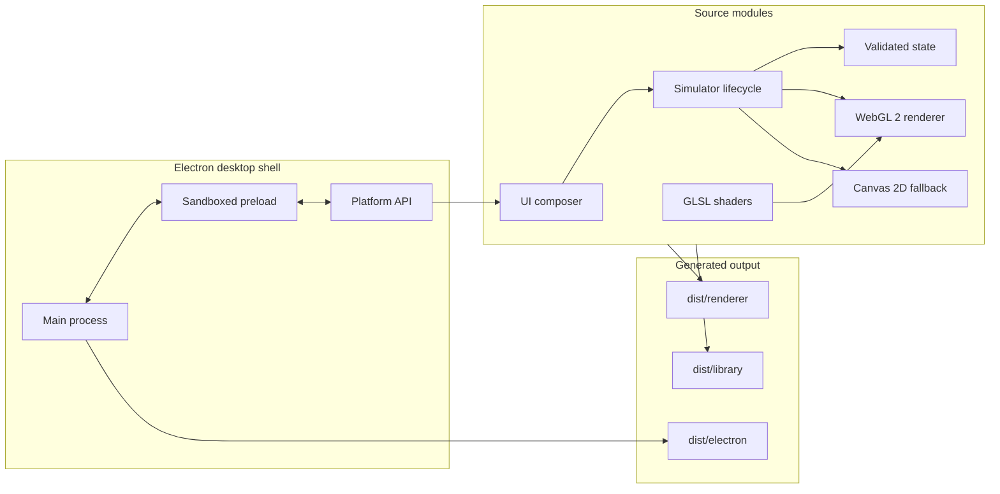

# Gargantua architecture

Gargantua separates rendering, simulation state, interface composition, and operating-system access. The same simulation core runs inside the Electron app and as a reusable browser module.

## Design goals

- Produce a responsive, cinematic black-hole visualization on common GPUs.
- Remain useful when WebGL 2 is unavailable.
- Keep every simulator instance independent and disposable.
- Keep the desktop renderer offline and isolated from Node.js.
- Generate desktop and browser outputs from one source tree.
- Make interaction possible by pointer, touch, keyboard, and assistive technology.

The renderer favors a stable visual approximation and interactive frame rate. It does not integrate null geodesics or model a physically calibrated black-hole system.

## System overview

## Module map

| Path | Responsibility |
| --- | --- |
| `src/simulation/state.js` | Public options, defaults, presets, clamping, validation, formatting, and bounded time advancement |
| `src/simulation/quality-controller.js` | Manual quality profiles and Auto mode's promotion/degradation hysteresis |
| `src/simulation/simulator.js` | Instance lifecycle, state subscriptions, animation scheduling, input, resize/visibility handling, renderer selection, screenshots, and disposal |
| `src/rendering/webgl-renderer.js` | WebGL 2 resource creation, multi-pass scene/bloom/composite pipeline, resize, draw, and GPU cleanup |
| `src/rendering/fallback-renderer.js` | Deterministic Canvas 2D star field, rings, and disk used when WebGL cannot run |
| `src/rendering/shaders/` | Full-screen vertex shader, procedural scene shader, separable bloom shader, and final composite shader |
| `src/ui/app.js` | Complete GUI, presets, controls, dialogs, shortcuts, export actions, announcements, and preference updates |
| `src/platform-api.js` | Stable interface for preferences, screenshots, clipboard, app metadata, and fullscreen across web and desktop hosts |
| `src/electron/main.cjs` | Window lifecycle, custom protocol, validated IPC, local file writes, navigation policy, permissions, and network blocking |
| `src/electron/app-identity.cjs` | Immutable product, executable, Squirrel, bundle, and Windows identity shared by runtime and packaging |
| `src/electron/app-lifecycle.cjs` | Single-instance ownership and focus/restore behavior for repeat launches |
| `src/electron/preload.cjs` | Minimal context-isolated bridge exposed as `window.gargantuaDesktop` |
| `src/electron/preferences.cjs` | Allowlist validation for persisted preferences and window geometry |
| `scripts/build.mjs` | Recreates `dist/`, converts GLSL to ES modules, copies app/library/desktop sources, and generates icons |
| `scripts/write-release-checksums.mjs` | Streams generated packages through SHA-256 and writes a release manifest |
| `scripts/serve.mjs` | Local preview server with a fixed MIME allowlist and repository-boundary checks |

## Runtime data flow

1. `src/main.js` asks the platform API to load preferences.
2. `mountBlackHoleApp` creates controls and calls `createSimulator` with the saved state.
3. `createSimulator` validates state and attempts to initialize the WebGL 2 renderer.
4. If WebGL setup fails, or if its context is later lost, the simulator replaces the canvas and starts the Canvas 2D renderer.
5. Pointer, keyboard, or interface input calls `setOptions`.
6. `updateState` validates the entire patch before returning a fresh state. Invalid patches cannot partially mutate the current state.
7. Subscribers receive a snapshot containing a copied state, renderer kind, effective quality, and status message.
8. The interface synchronizes controls and queues a debounced preference save through the platform API.

Desktop preference writes travel through the preload bridge to validated IPC handlers. Browser-preview preferences use local storage.

## Rendering pipeline

The WebGL renderer uses one full-screen triangle and five framebuffer targets:

1. **Scene pass:** The procedural fragment shader draws the black-hole shadow, warped disk, photon ring, lensing arcs, and star field.
2. **Near bloom:** The full-resolution scene is thresholded and blurred horizontally and vertically at quarter resolution.
3. **Far bloom:** The near result is downsampled again and blurred at roughly one-fourteenth resolution.
4. **Composite:** Scene, near bloom, and far bloom are combined with the current glow/exposure value on the default framebuffer.

When `EXT_color_buffer_float` is present, intermediate targets use `RGBA16F`; otherwise they use `RGBA8` and a lower bloom threshold. The canvas does not preserve its drawing buffer. Screenshot capture performs an explicit draw before converting the canvas to a PNG blob.

The fallback renderer uses a seeded star field and layered ellipses on a 2D canvas. Its deterministic seed keeps the fallback stable across redraws.

## Animation, quality, and resource control

Each simulator owns:

- Its canvas and renderer resources
- A copied state object and subscribers
- Resize and intersection observers
- An animation frame loop
- Pointer, wheel, keyboard, motion-preference, and visibility listeners

The render loop stops drawing while the document or simulator is not visible. A paused simulation redraws only when state or dimensions change. Elapsed animation time is capped after tab suspension to prevent a large visual jump.

Auto quality begins at Balanced. Ten sustained frames slower than 72 ms move it down one level. Three hundred sustained frames faster than 48 ms move it up one level. Separate counters provide hysteresis so a brief spike does not repeatedly switch resolutions.

`dispose()` is idempotent. It cancels animation, disconnects observers, aborts events, deletes WebGL resources, clears subscriptions, and removes the canvas. A detached container also causes its simulator to dispose itself.

## Desktop boundary and threat model

The desktop renderer is treated as untrusted web content even though its files are local.

### Window isolation

- Renderer sandboxing is enabled.
- Context isolation is enabled.
- Node integration is disabled.
- The app exposes no `require` or Node `process` object to the renderer.
- New windows, webviews, permissions, and navigation away from the app protocol are denied.
- A single-instance lock makes subsequent shortcut launches restore and focus the existing window.

### Local protocol

The main process registers `gargantua://` as a secure standard scheme. Its handler maps requests to built renderer assets and must never expose files outside `dist/renderer`.

Keep the asset resolver synchronized with every path required by the renderer's module graph. Automated Electron startup tests are the authority for whether the packaged protocol resolves the complete graph.

### Content and network restrictions

The document Content Security Policy allows local scripts and styles, data/blob images, and no network connections. The Electron session independently cancels HTTP, HTTPS, and WebSocket requests. All permission checks return false.

### IPC

The preload exposes only app metadata, preference load/save, PNG save/copy, fullscreen control, and fullscreen-state notifications. Every main-process handler verifies that the sender is the current app window on `gargantua://app/`.

Preference objects are allowlisted and clamped before persistence. PNG IPC accepts only data with a valid PNG signature and a maximum size of 64 MiB. Screenshot names are reduced to a narrow safe pattern before a save dialog is shown.

Preferences and window state are written atomically to JSON files in Electron's user-data directory. Temporary files are renamed only after a complete write.

## Build pipeline

`pnpm build` runs `scripts/build.mjs`:

1. Delete and recreate the repository's `dist/` directory.
2. Generate PNG and ICO application icons from `assets/icon.svg`, including the tracked Windows Installed apps icon.
3. Copy simulation, rendering, and interface modules into `dist/renderer` and `dist/library`.
4. Convert each `.vert` and `.frag` source into a generated JavaScript module exporting a string, then rewrite renderer imports to use those modules.
5. Copy the desktop shell into `dist/electron`.
6. Copy the renderer entry page, platform adapter, styles, public library entry, package metadata, and license.

Electron Forge invokes the same build as its `generateAssets` hook. Packaging uses ASAR with dependency pruning. The fuses disable Electron's run-as-Node mode, `NODE_OPTIONS`, and inspect arguments, enable cookie encryption and ASAR integrity validation, and require application code to load from ASAR.

Before a Windows make, `scripts/prepare-squirrel-tooling.mjs` verifies a pinned NuGet SHA-256 and replaces Squirrel's legacy bundled copy from the ignored local cache. A missing cache entry is downloaded from the official NuGet distribution host and accepted only when its checksum matches.

The Squirrel package installs per user, launches the app, and delegates Desktop and Start-menu shortcut lifecycle to the early Squirrel event handler. The package name, executable name, App User Model ID, and hosted installer icon URL are immutable release identity; changing one after publication would break upgrade, shortcut, or Installed apps continuity. The Forge `postMake` hook writes `SHA256SUMS.txt` for the user-facing packages using their flat release filenames.

Pushing a version tag that matches `package.json` invokes `.github/workflows/release.yml`. The workflow requires signing secrets, verifies both executable signatures, exercises install and uninstall behavior, and only then creates a GitHub Release containing the Windows installer, portable ZIP, and checksum manifest. Unsigned local and CI artifacts remain available for development.

Generated outputs are disposable and must not be edited directly.

## Public library contract

`dist/library/index.js` exports:

- `createSimulator`
- `mountBlackHoleApp`
- `DEFAULT_STATE`
- `PARAMETERS`
- `PRESETS`
- `QUALITY_MODES`

`createSimulator` is the smallest integration surface and needs only a sized DOM element. `mountBlackHoleApp` builds the full interface and additionally requires a platform API with the methods defined in `src/platform-api.js`.

Public-state changes should remain backward compatible within a major version. Adding a new option requires coordinated updates to state validation, desktop preference sanitization, interface controls or presets where appropriate, tests, and README documentation.

## Test strategy

| Layer | What it protects |
| --- | --- |
| Node unit tests | State invariants, time advancement, quality transitions, preference sanitization, window-state validation, and preview-server boundaries |
| Browser tests | WebGL smoke rendering, request locality, controls, presets, responsive layout, PNG export, Canvas fallback, instance isolation, and disposal |
| Electron tests | Custom protocol, sandbox surface, CSP enforcement, navigation denial, and persistence across a complete relaunch |

Visual output still needs human review on representative integrated and discrete GPUs. Pixel-perfect snapshots are intentionally avoided because shader precision and driver behavior vary across machines.
